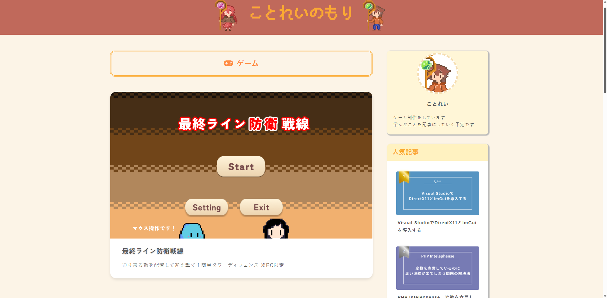

## 🚀 プロジェクト概要

本プロジェクトは、自作CMSを用いて構築した技術系ブログサイトです。  
ブログ記事の投稿・編集・削除などの基本的なCMS機能を自作し、記事の管理・公開を行なっています。  

このブログでは主にゲーム開発やプログラミングに関する技術記事と無料で遊べるゲームを掲載しています。  
記事の表示にはマークダウン、コード表示にはPrism.js、数式表示にはMathJaxを用いるなど、**読みやすく整った表示**を実現しています。

## 🌐 公開サイト

[ことれいのもり](https://kotorei.com/)

実際に動作しているサイトです。  
ブログ記事やゲームの公開ページが確認できます。

## 🎯 目的・背景

以前は個人制作したゲームをGoogle Play Storeに公開していました。
しかし、API上限やポリシー変更により定期的なアップデートが必要となり、運用負荷が高くなっていました。  
また、iPhone向けに公開するにはMac端末が必須であるなど、プラットフォームによる制約も課題となっていました。

そこで、**「一度公開したら、誰でも・どんな端末からでも半永久的に遊べる場を自分で作りたい」** と考えるようになり、  
UnityのWebGLを活用したゲーム公開サイトを構築しました。  
さらに、開発中の技術的な気づきを発信する手段として、**CMSを自作し、ブログ機能を実装**しました。    

当初は「WordPressなどの既存CMSを使うとサイト全体が重くなり、WebGLの動作に影響するのでは？」という懸念もあり、  
軽量でシンプルな構造を目指して、必要な機能を備えたCMSの開発に挑戦しました。  
後に技術的にはWebGLの動作とCMSの処理が直接関係ないことに気づきましたが、この経験を通して、**構成の分離・パフォーマンス・セキュリティへの配慮**といった観点を深く学ぶことができました。  

## 🎥 デモ動画
[▶ YouTubeで動画を見る](https://youtu.be/jf8K3Dq6UK8)  

デモ動画です。  
操作イメージの参考にご覧ください。  

## ⚙️ 機能一覧

### CMS部分
<table>
  <tr>
    <td>ログイン画面</td>
    <td>管理画面</td>
  </tr>
  <tr>
    <td></td>
    <td></td>
  </tr>
  <tr>
    <td>管理画面のログイン画面です。</td>
    <td>管理画面のトップページです。 
      記事一覧の閲覧、新規作成、編集、削除、公開状態の確認、公開日時の設定が行えます。
    </td>
  </tr>
</table>

<table>
  <tr>
    <td>新規作成画面</td>
    <td>編集画面</td>
  </tr>
  <tr>
    <td></td>
    <td></td>
  </tr>
  <tr>
    <td>
      新規作成画面です。 
      全ての項目が空欄の状態で表示されます。
    </td>
    <td>編集画面です。 
      データベースから取得した情報が各項目に反映された状態で表示されます。</td>
  </tr>
</table>

### ブログ部分
<table>
  <tr>
    <td>ブログトップ画面</td>
  </tr>
  <tr>
    <td>
      
    </td>
  </tr>
  <tr>
    <td>
      ブログトップ画面の全体図です。 
      無料で遊べるゲームが表示され、 
      サイドバーには集計された人気記事の上位3件が表示されます。 
      記事一覧は最新の順に並んでおり、各記事の詳細画面に遷移できます。
    </td>
  </tr>
</table>

<table>
  <tr>
    <td>記事画面</td>
  </tr>
  <tr>
    <td></td>
  </tr>
  <tr>
    <td>
      記事の詳細ページです。 
      データベースに保存された記事を表示します。
    </td>
  </tr>
</table>

## 🛠️ 主な使用技術

### フロントエンド

- **HTML**
- **CSS**
- **JavaScript**

### バックエンド

- **PHP**
- **MySQL**

### ローカル環境

- **XAMPP**

### 本番環境

- **Xserver**

### PHPライブラリ

- **Parsedown** v1.7
- **Google API Client** v2.13
- **Google Analytics Data API** v0.22.2
- **phpdotenv** v5.6

### JavaScriptライブラリ（CDNで読み込み）

- **Prism.js**
- **MathJax**

## 🧑‍💻 開発体制・期間
- **開発者**: 個人開発（1人）
- **開発期間**
  - 制作：2024年11月～2025年2月（約4ヶ月）
  - 運営：2025年2月～現在（記事の追加・機能改良を継続中）

## ✅ 工夫した点

1. マークダウンとMathJaxに対応した記事出力処理

記事本文はマークダウン形式でデータベースに保存し、表示時にHTMLへ変換しています。  
変換にはParsedownを使用していますが、標準機能のままでは意図した構造になりませんでした。  

そのため、独自に`CustomParsedown`クラスを作成し、以下のような機能を追加しています。  
- マークダウンの各要素に自動でCSSクラスを付与（例：`<h2 class="underline-with-background">`）  
- LateX形式の数式（`$$ $$`）を正しく表示できるように、MathJax用の整形処理を挿入  

これにより、マークダウンの記述だけで適切な見出し・構文ハイライト・数式表示が可能です。  

対応のコードリンク：[CustomParsedown.php](app/libs/CustomParsedown.php)  
実装に関する解説記事：[ParsedownのHTMLにCSSクラスをつける拡張クラスを作ってみた](https://kotorei.com/PHP/parsedown-extensionclass-25)  

2. MVCモデルの構成

本プロジェクトでは、学びながらMVCモデル（Model/View/Controller）を意識した構成に挑戦しました。        
以下のような責務分離をしています。  

- Model: DBとの接続・データ取得（[models/ArticleModel.php](app/models/ArticleModel.php)など） 
- Controller: 記事の取得やルーティング（[controllers/PublicArticleListController.php](app/controllers/PublicArticleListController.php)など）
- View: HTMLとPHP埋め込みの表示担当（[views/home/article.php](app/views/home/article.php)など）

この構成により、どこでどの処理をしているかが分かりやすくなり、機能追加や修正が影響する範囲を小さくしました。  

3. CSRFトークンによるセキュリティ対策

管理画面のログインや記事作成など、重要な部分にはCSRF対策をしています。  
これにより、意図しない外部サイトからの攻撃リスクを減らしています。  

対応のコードリンク：[CSRFProtection.php](app/models/CSRFProtection.php)   

4. 軽量でシンプルなCMS機能

本CMSでは、「記事の作成・編集・削除・公開」という基本機能に絞って構成しました。  
ページ遷移・表示速度などを意識し、以下の方針で設計しています。  

- ロジックはPHPで完結し、ライブラリなどは最小限
- 記事の入力にはマークダウンを採用し、Parsedown + カスタムクラスでHTML化
- レイアウトはHTML/CSSベースで、記事部分はレスポンシブ対応
- 管理画面の構成・レイアウトはシンプルかつ拡張しやすいように

このように、軽量かつ柔軟な構成を意識することで、ゲーム公開サイトとしての将来的な拡張性もあります。

## 🔧 今後の課題及び追加予定機能

- **PHPエラーログの管理機能**  
  ログ出力の方式を整理し、Web上からログを確認・削除できるようにすることで、デバッグ効率を高める予定です。

- **公開ゲームの管理機能**  
  ブログ記事とは別に、公開中のゲーム一覧を管理できる画面を実装予定です。

- **記事プレビュー機能**  
  マークダウン入力中の記事がその場でプレビューされる機能を追加し、執筆効率を上げたいと考えています。

- **文字装飾の強化**  
  現在は文字装飾手段が限られているので、色変更などの表現をマークダウンベースで柔軟に設定できるようにしたいです。

- **既知バグの洗い出し・改善**  
  運用する中でいくつかの表示崩れやパス間違いなどの軽微な不具合に気づいています。段階的な修正を進める予定です。

## ⚠️ 注意事項
- 本リポジトリはポートフォリオ用途や、実際に運用しているブログサイトの構成や設計意図を共有することを目的としています。

- `.env`ファイルや管理ユーザー情報に関する機密情報もGitには含めていません。

- 本番環境で運用しているバージョンと、このリポジトリ内のコードには一部差分がある可能性があります。（ファイル構成など）
  
- 公開しているのは主にフロントエンド（ブログ閲覧画面）およびCMSの処理ロジックであり、**実際のログイン体験は提供していません。**  
  代わりに、動作や操作感が分かるような簡易デモ動画を掲載しています。
  
