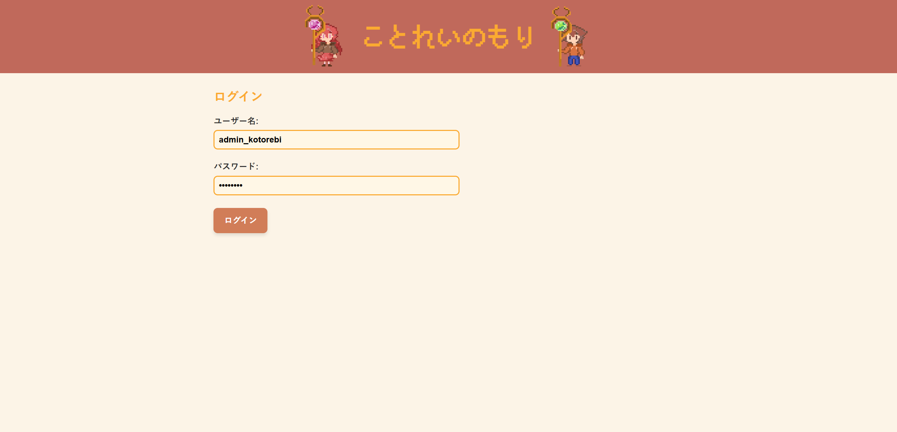
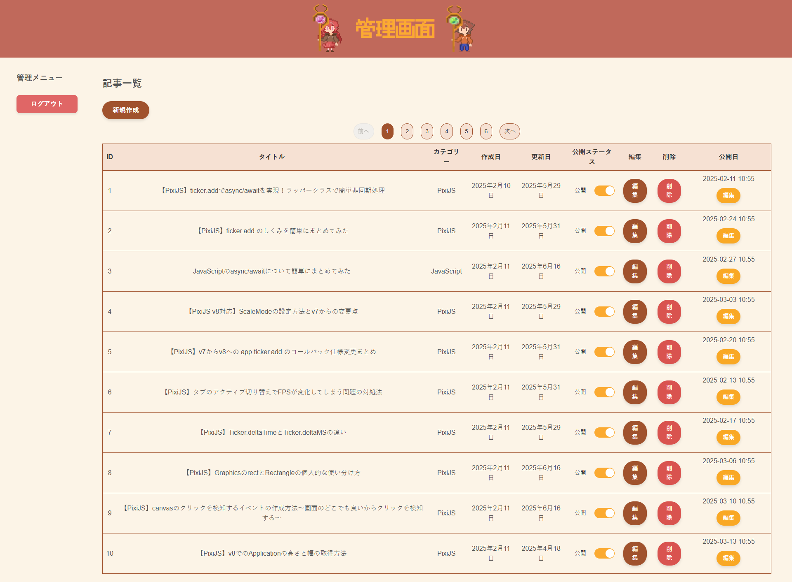
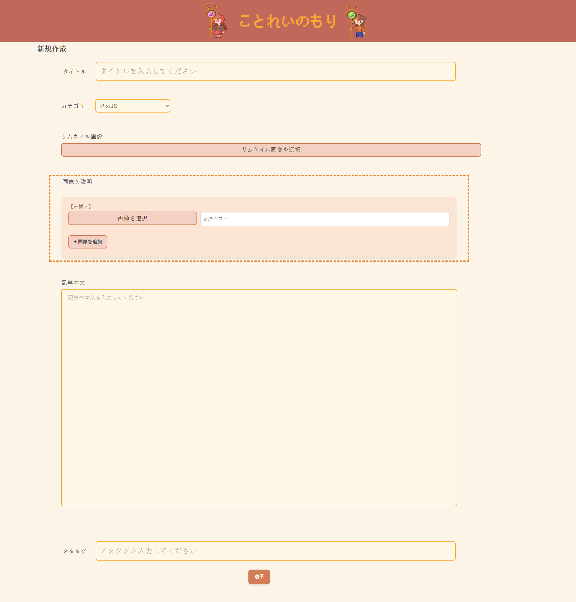
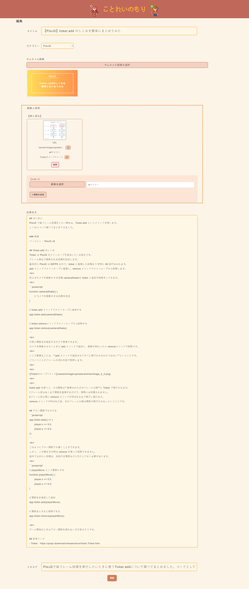
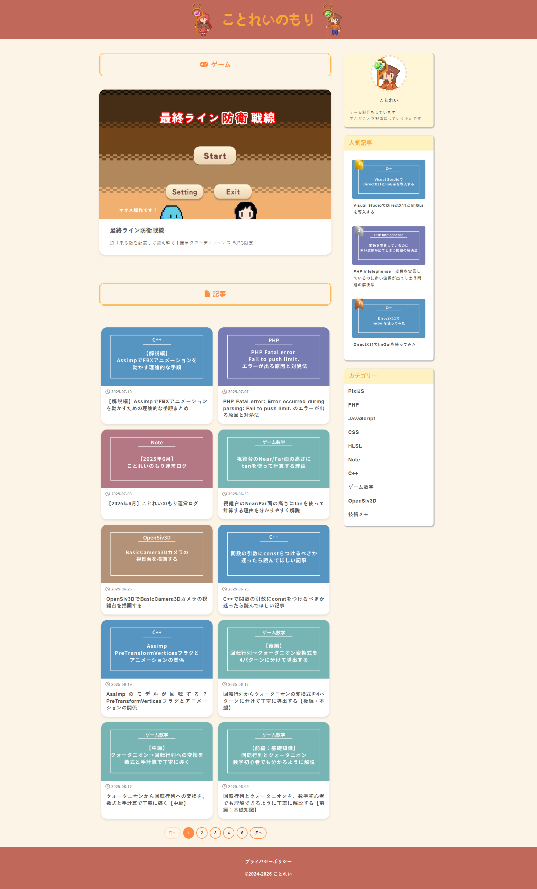
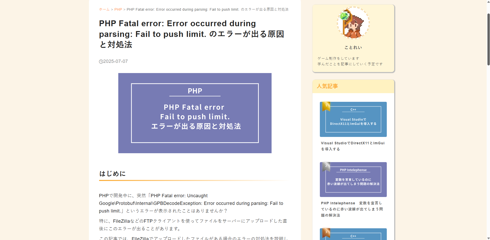

## 🚀 プロジェクト概要
本プロジェクトは、自作CMSを用いて構築した技術系ブログサイトです。  
ブログ記事の投稿・編集・削除などの基本的なCMS機能を自作し、記事の管理・公開を行なっています。  

このブログでは主にゲーム開発やプログラミングに関する技術記事と無料で遊べるゲームを掲載しています。  
CMSはWordPressなどの既存ツールに依存せず、自分の用途に合わせて自由に設計・開発しました。  
そのため、不要な要素を削除し、必要な要素だけで構成された軽量なシステムとなっています。  

## 🎯 目的・背景
以前は個人制作したゲームをGoogle Play Storeに公開していましたが、
API上限やポリシー変更により定期的なアップデートが必要となり、運用負荷が高くなりました。  
また、iPhone向けに公開するにはMac端末が必須であるなど、プラットフォームによる制約も課題となっていました。

そこで、「一度公開したら半永久的に誰でも遊べる場所を自分の手で作りたい」と考え、どんな端末からでもアクセス可能なブラウザゲームサイトの構築を目指しました。  
その中で、技術的な気づきを発信する手段として、ブログ機能が必要になり、CMSを自作するに至りました。  

WordPressなどの既存のCMSを使わなかった理由は、「ゲームを快適に楽しんでほしい」というこだわりです。  
UnityのWebGL版のゲームは  初回ロードで大きなデータを読み込むため、メモリ消費が激しく、CMSが重いとロード時間やプレイ体験に影響を与える可能性があります。  
そのため、記事作成・編集・削除といった必要最低限の機能に絞り、軽量な自作CMSを独自に開発しました。  

## ⚙️ 機能一覧
### CMS部分
<table>
  <tr>
    <td>ログイン画面</td>
    <td>管理画面</td>
  </tr>
  <tr>
    <td></td>
    <td></td>
  </tr>
  <tr>
    <td>管理画面へのログイン画面です。</td>
    <td>管理画面のトップページです。 
      記事一覧の閲覧、新規作成、編集、削除、公開状態の確認、公開日時の設定が行えます。
    </td>
  </tr>
</table>

<table>
  <tr>
    <td>新規作成画面</td>
    <td>編集画面</td>
  </tr>
  <tr>
    <td></td>
    <td></td>
  </tr>
  <tr>
    <td>
      新規作成画面です。 
      全ての項目が空欄の状態で表示されます。
    </td>
    <td>編集画面です。 
      データベースから取得した情報が各項目に反映された状態で表示されます。</td>
  </tr>
</table>

### ブログ部分
<table>
  <tr>
    <td>ブログトップ画面</td>
  </tr>
  <tr>
    <td>
      
    </td>
  </tr>
  <tr>
    <td>
      ブログトップ画面の全体図です。 
      無料で遊べるゲームが表示され、 
      サイドバーには集計された人気記事の上位3件が表示されます。 
      記事一覧は最新の順に並んでおり、各記事の詳細画面に遷移できます。
    </td>
  </tr>
</table>

<table>
  <tr>
    <td>記事画面</td>
  </tr>
  <tr>
    <td></td>
  </tr>
  <tr>
    <td>
      記事の詳細ページです。 
      データベースに保存された記事を表示します。
    </td>
  </tr>
</table>

## 🛠️ 主な使用技術
### フロントエンド
- **HTML**: Webサイト全体のベース構築
- **CSS**: レイアウトの2カラム、ブログ部分のレスポンシブ対応を実装
- **JavaScript**: Prism.jsによるコードハイライトや、動的処理の一部を実装

### バックエンド
- **PHP 8**: CMSの投稿・編集・削除などのロジック、HTML内への変数埋め込み、DB接続
- **MySQL**: 記事、ユーザー情報を保存するデータベースとして使用

### ローカル環境
- **XAMPP**: ローカルでの開発・動作確認用に利用

### 本番環境
- **Xserver**: Webサイトの公開用として契約。独自ドメイン取得・SSL対応済

### PHPライブラリ
- **Parsedown** v1.7: マークダウン形式の記事をHTMLに変換するために使用
- **Google API Client** v2.13: Google Analyticsと連携
- **Google Analytics Data API** v0.22.2: 人気記事ランキングに使用
- **phpdotenv** v5.6: `.env`ファイルから環境変数を読み込み、認証情報を安全に管理

### JavaScriptライブラリ（CDNで読み込み）
- **Prism.js**: ブログ記事中のコードブロックに構文ハイライトを使用
- **MathJax**: LateX形式の数式を表示するために使用

## 工夫した点
準備中

## 今後の課題及び追加予定機能
準備中
